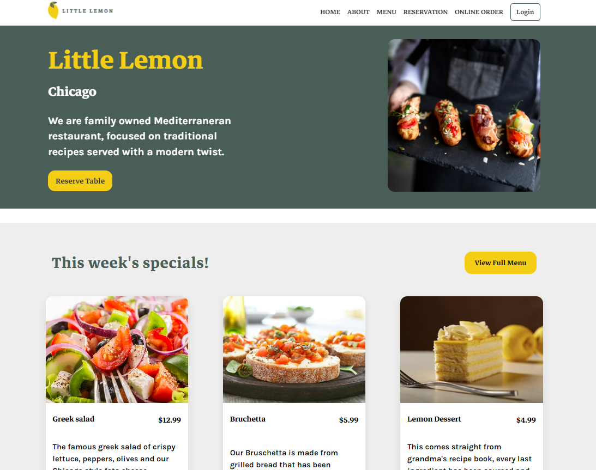
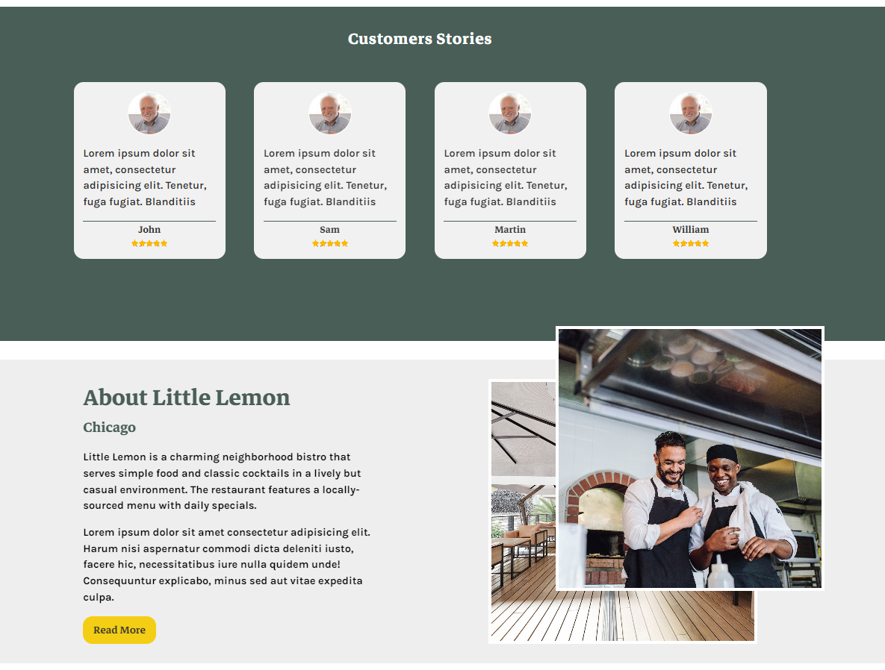
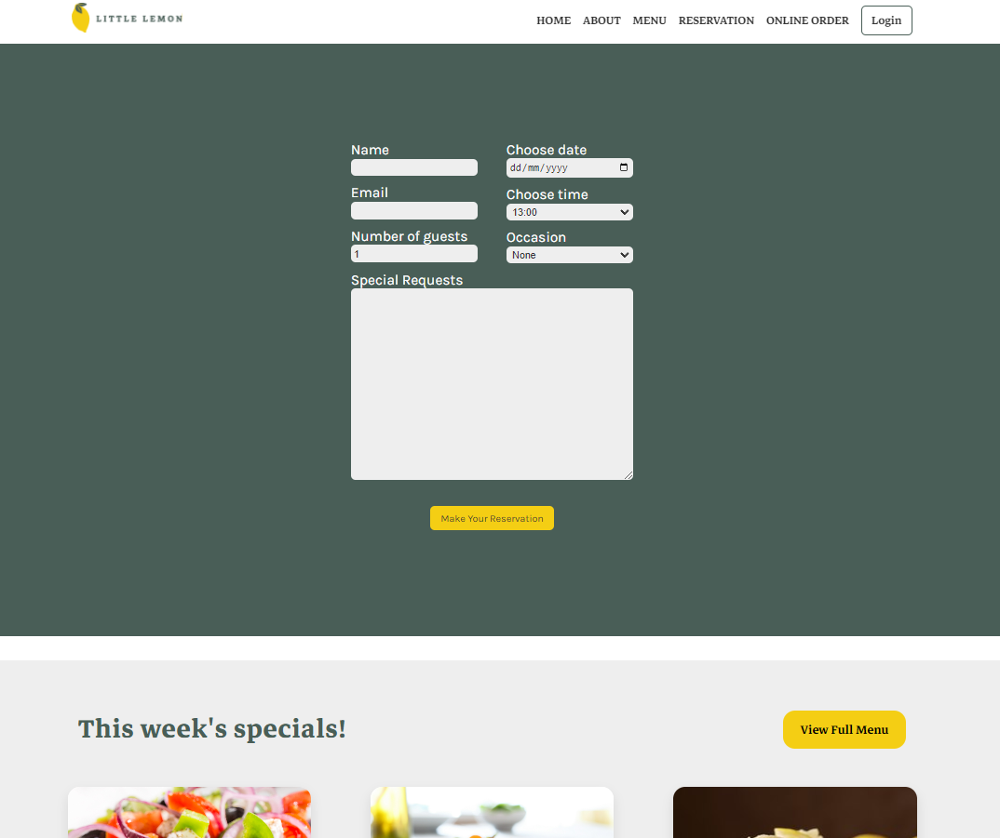
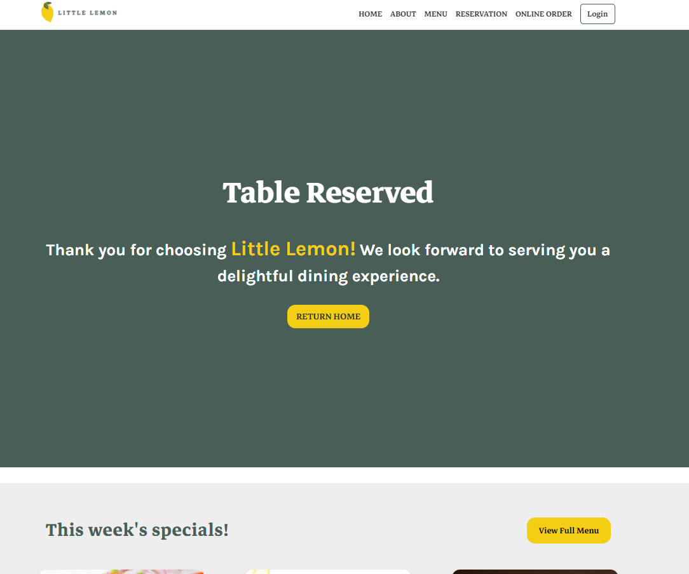

# Little Lemon Restaurant Website

Welcome to Little Lemon! This project is the capstone for the Meta Front-end
Developer Professional Certificate, showcasing the skills acquired during the
program. Built with create-react-app and styled with basic CSS featuring effects and
animations, Little Lemon is designed to provide a seamless reservation experience for
our valued customers.

## [Table of Contents](#intro)

- [Introduction](#intro)
- [Features](#features)
- [Testing](#testing)
- [Usage](#usage)
- [Screenshots](#screenshots)

## Features

### Reservation Screen

- Date Picker: Easily select the desired reservation date.
- Time Input: Specify the preferred time for your reservation.
- Number of Diners: Input the number of guests joining the dining experience.
- Occasion Input: Share the purpose of your visit (e.g., birthday, anniversary).
- Client side form validation

### Customer Details Screen

- Name Fields: Enter your name of user
- Contact Information: Provide an email for booking confirmation.
- Required Field Indicators: Clearly marked fields ensure all necessary information
  is provided.
- Submit Button: Confirm and submit your reservation details for processing.

### Error handling

- Input Warnings: Receive relevant warnings if required fields are left blank via
  client side validation
- Confirmation Message: Customers are informed upon submission of the reservation
  form.

### Testing

Unit tests for booking logic have been implemented using Jest.

## Usage

1. Access reservation via reserve button
2. Fill in the required details for reservation
3. Receive confirmation mesage upon form submission

## Screenshots

#### Hero section

#### About section

#### Form section

#### Confirmation message after form submission

